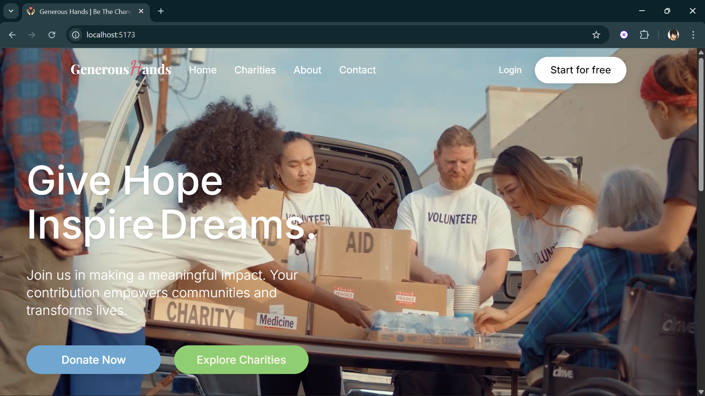
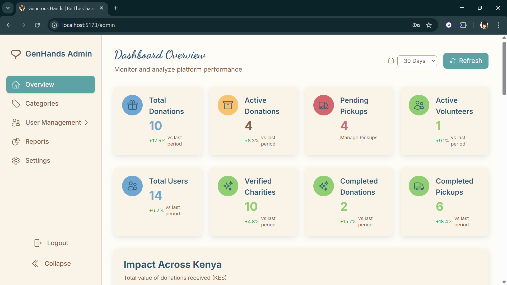

# 🌱 Generous Hands FrontEnd

Welcome to the **Generous Hands** FrontEnd!  
This is the React + Vite powered web application for connecting donors, charities, and volunteers to make giving easy, transparent, and impactful.

---

## 🚀 Features

- **Modern UI:** Beautiful, responsive design inspired by Studio Ghibli colors.
- **Donor Flow:** Submit donations, track status, and connect with charities.
- **Charity Dashboard:** Manage needs, review donations, and express gratitude.
- **Volunteer Missions:** Accept pickup/delivery tasks and earn badges.
- **Secure & Fast:** Built with Vite, React, and TailwindCSS for optimal performance.

---

## 📸 Screenshots 





---

## 🛠️ Tech Stack

- **React** (with hooks)
- **Vite** (blazing fast dev/build)
- **TailwindCSS** (utility-first styling)
- **Heroicons** (modern SVG icons)
- **React Query** (data fetching/caching)
- **Axios** (API requests)

---

## 📦 Installation

```bash
# Clone the repo
git clone https://github.com/your-org/genhands-frontend.git
cd genhands-frontend

# Install dependencies
npm install

# Start the development server
npm run dev
```

## 🗂️ Project Structure

src/

  ├── components/         # Reusable UI components

  ├── hooks/              # Custom React hooks

  ├── pages/              # App pages (Dashboard, FAQ, HowItWorks, etc.)

  ├── assets/             # Images and icons

  ├── styles/             # Global and custom styles

  └── App.jsx             # Main app entry

## 📬 Contact

Questions or feedback?
Email us at janny.jonyo@strathmore.edu OR dennis.mukoma@strathmore.edu
